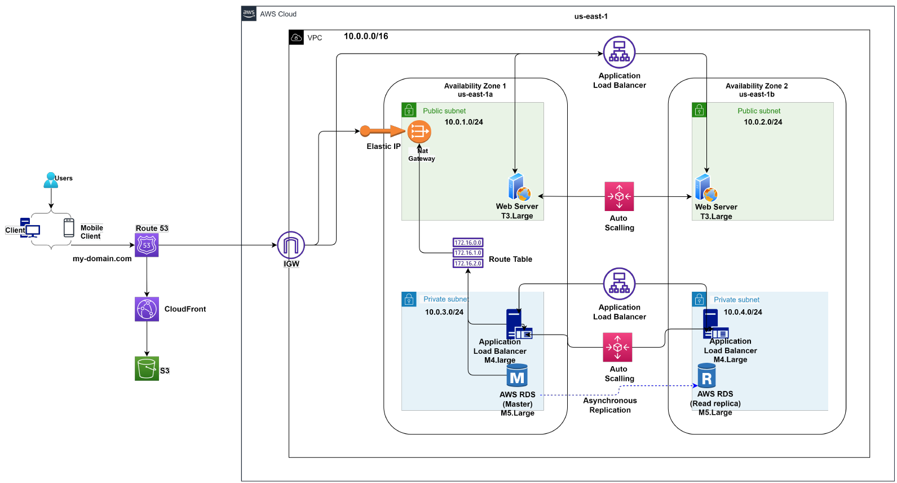
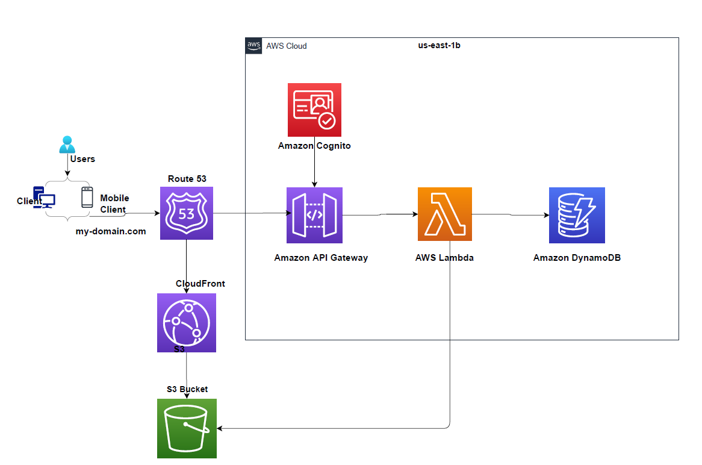

# Task 1: Create AWS Architecture Schematics

### A.3.1 Part 1

You have been asked to plan and provision a cost-effective AWS infrastructure for a new social media application development project for 50,000 single-region users. The project requires the following AWS infrastructure and services. Please include your name and label all elements of the infrastructure on the diagram.

* Infrastructure in the following regions: us-east-1
* Users and Client machines
* One VPC
* Two Availability Zones
* Four Subnets (2 Public, 2 Private)
* A NAT Gateway
* A CloudFront distribution with an S3 bucket
* Web servers in the Public Subnets sized according to your usage estimates
* Application Servers in the Private Subnets sized according to your usage * estimates
* DB Servers in the Private Subnets
* Web Servers Load Balanced and Autoscaled
* Application Servers Load Balanced and Autoscaled
* A Master DB in AZ1 with a read replica in AZ2.

Use [LucidChart](https://www.lucidchart.com/) or a similar diagramming application to create your schematic. Export your schematic as a PDF and save as ``Udacity_Diagram_1.pdf``.

 

<b> Part1 - AWS Architecture Schematics </b>

### A.3.2 Part 2

You have been asked to plan a SERVERLESS architecture schematic for a new application development project. The project requires the following AWS infrastructure and services.

* A user and client machine
* AWS Route 53
* A CloudFront Distribution
* AWS Cognito
* AWS Lambda
* API Gateway
* DynamoDB
* S3 Storage

Export your schematic as a PDF and save as ``Udacity_Diagram_2.pdf``

 

<b> Part2 - AWS Architecture Schematics </b>
