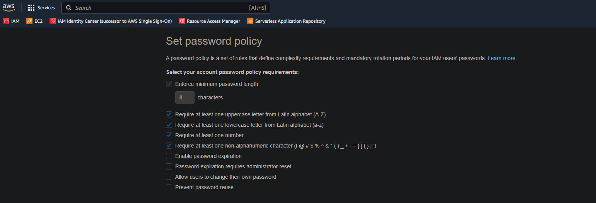

## [OPTIONAL] Task 3: Configure Permissions

> Attempt this task only if you are using your personal AWS account.

In order to complete this task, please ensure your IAM users have been [granted access to the billing dashboard](https://docs.aws.amazon.com/awsaccountbilling/latest/aboutv2/control-access-billing.html) (Activating Access to the Billing and Cost Management Console).

1. Update the AWS password policy.

   * Minimum password length = 8
   * Require at least one uppercase letter
   * Require at least one lowercase letter
   * Require at least one number
   * Require at least one non-alphanumeric character.

  Submit a screenshot of the Password Policy from the IAM Account settings page. Name the screenshot ``udacity_password_policy.png or udacity_password_policy.jpg``.

<b> Udacity Password Policy </b>

1. Create a Group named ``CloudTrailAdmins`` and give it the two ``CloudTrail`` privileges.

2. Create a Group named Reviewers and give it the ``Billing`` privilege.

3. Configure a user named ``CloudTrail`` and a user named ``Accountant``. Give the users AWS Console access and assign them a password that conforms to your password policy. **Require them to change their password when they login.**

4. Assign ``CloudTrail`` to the ``CloudTrailAdmins`` group. Assign ``Accountant`` to the ``Reviewers`` group .

5. Test both user accounts by logging into the AWS console as the users ``CloudTrail`` and ``Accountant`` after changing their passwords on login. Login using your numerical AccountID.

6. While logged-in as the user ``CloudTrail``, go to the CloudTrail page and create a trail named ``Udacity_Trail``. Enable logging on all Read/Writes Management Events and S3 and Lambda events Data Events. Create a new S3 Bucket to store the CloudTrail log. There is no need for advanced configuration.

7. Download the portion of the CloudTrail log that shows the entire Task 3 timeframe and save it as ``UdacityCloudTrailLog.csv``.

8. Before Logging off, return to the CloudTrail configuration page. Disable S3 logging.
