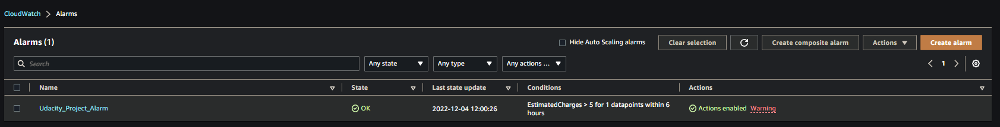

## [OPTIONAL] Task 4: Set up Cost Monitoring

1. Configure CloudWatch billing alarm

2. Set up a Billing alarm with a $5 threshold

3. Set up notification so that you get an email alert when the alarm is triggered.

Save a screenshot of the CloudWatch Alarms page showing the new alarm with a green OK status as ``CloudWatch_alarm.png`` or ``CloudWatch_alarm.jpg``
ovision AWS Infrastructure

 

<b> CloudWatch Alarm </b>

