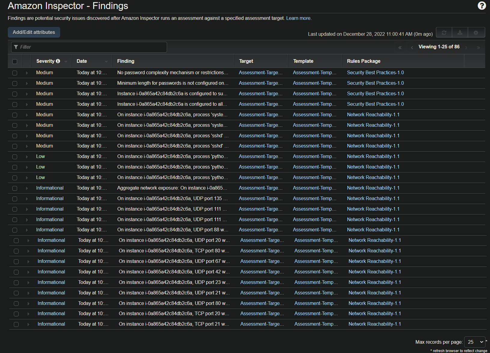
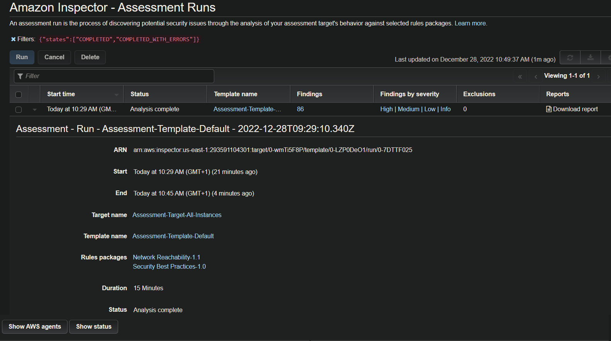
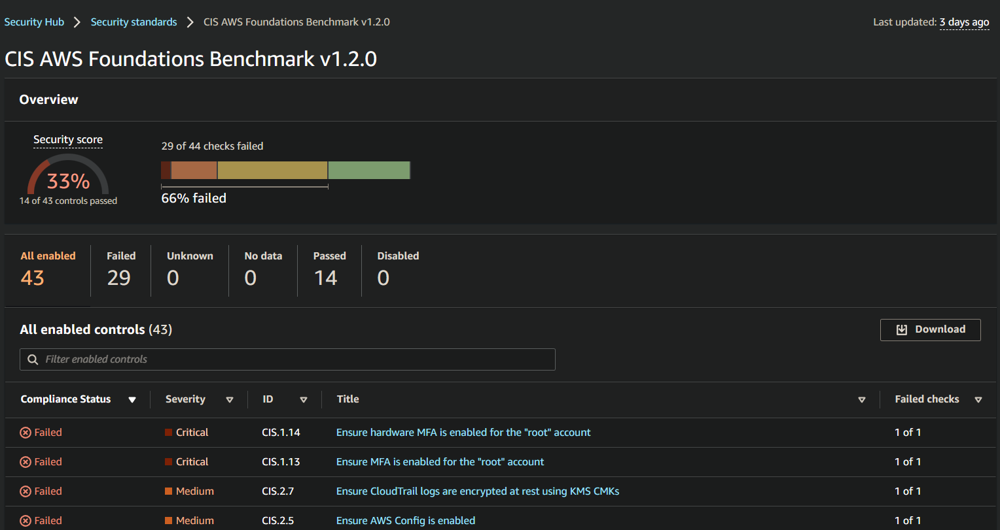

# Exercise 2 - Enable Security Monitoring

First, we will set up security monitoring to ensure that the AWS account and environment configuration is in compliance with the CIS standards for cloud security.
____

## Task 1: Enable Security Monitoring using AWS Native Tools

First, we will set up security monitoring to ensure that the AWS account and environment configuration is in compliance with the CIS standards for cloud security.

### 1. Enable AWS Config (skip this step if you already have it enabled)

### 2. Enable AWS Security Hub

### 3. Enable AWS Inspector scan

### 4. Enable AWS Guard Duty

## Task 2: Identify and Triage Vulnerabilities

Please submit screenshots of:

* **AWS Config** - showing non-compliant rules

* **AWS Inspector** - showing scan results

* **AWS Security Hub** - showing compliance standards for CIS foundations.

Name the files ``E2T2_config.png``, ``E2T2_inspector.png``, ``E2T2_securityhub.png`` respectively.

Research and analyze which of the vulnerabilities appear to be related to the code that was deployed for the environment in this project. Provide recommendations on how to remediate the vulnerabilities. Submit your findings in ``E2T2.txt``

`**Deliverables**:

* **E2T2_config.png** - Screenshot of AWS Config showing non-compliant rules.

|  |
|:--:|
| <b>Screenshot of AWS Config</b>|

* **E2T2_inspector.png** - Screenshot of AWS Inspector showing scan results.

|  |
|:--:|
| <b>Screenshot of AWS Inspector</b>|

|  |
|:--:|
| <b>Screenshot of AWS Inspector- Assessment_Runs</b>|

* **E2T2_securityhub.png** - Screenshot of AWS Security Hub showing compliance standards for CIS foundations.

|  |
|:--:|
| <b>Screenshot of AWS Inspector</b>|

**Deliverables**:

* [E2T2.txt](./E2T2.txt) - Text file identifying 2 poor security practices with justification.
