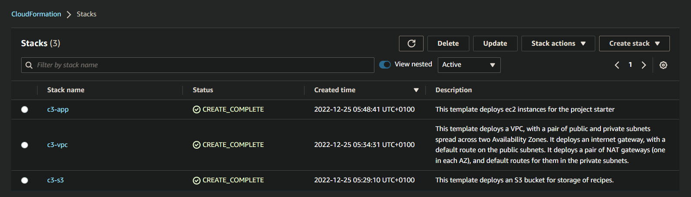
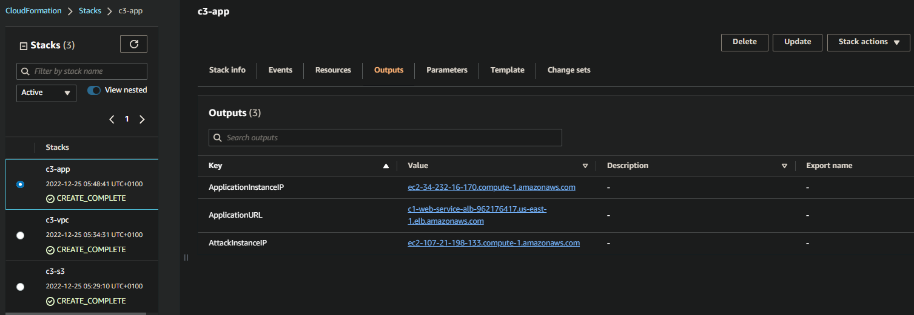

# Exercise 1 - Deploy Project Environment
____

## Task 1: Review Architecture Diagram


<p style='text-align: center; margin-right: 3em; font-family: Serif;'><b> Starting architecture diagram</b></p>
____

## Task 2: Review CloudFormation Template

In this task, the objective is to familiarize yourself with the starter code and to get you up and running quickly. Spend a few minutes going through the ``.yml`` files in the starter folder to get a feel for how parts of the code will map to the components in the architecture diagram.

Additionally, a CloudFormation template have been provided which will deploy the following resources in AWS:

#### 1. VPC Stack for the underlying network

* 1.1 A VPC with 2 public subnets, one private subnet, and internet gateways etc for internet access.
  * [c3-vpc.Yaml](./CloudFormation/c3-vpc-tk-nd202212.yml)

#### 2; S3 bucket stack

* 2.1 2 S3 buckets that will contain data objects for the application.
  * [c3-s3.Yaml](./CloudFormation/c3-s3-tk-nd202212.yml)

#### 3. Application stack

* An EC2 instance that will act as an external attacker from which we will test the ability of our environment to handle threats

* An EC2 instance that will be running a simple web service.

* Application LoadBalancer

* Security groups

* IAM role
  * [c3-app.Yaml](./CloudFormation/c3-app-tk-nd202212.yml)

## Task 3: Deployment of Initial Infrastructure

In this task, the objective is to deploy the CloudFormation stacks that will create the below environment.

### 1. From the root directory of the repository - execute the below command to deploy the templates.
#### A.1. Deploy the S3 buckets

````python
aws cloudformation create-stack
    --region us-east-1
    --stack-name c3-s3
    --template-body file://CloudFormation/c3-s3-tk-nd202212.yml
````

Result:

````JSON
{
    "StackId": "arn:aws:cloudformation:us-east-1:293591104301:stack/c3-s3/ad452fe0-840c-11ed-bdba-0a65dd233c97"
}
````

#### A.2. Deploy the VPC and Subnets

````python
aws cloudformation create-stack
    --region us-east-1
    --stack-name c3-vpc
    --template-body file://CloudFormation/c3-vpc-tk-nd202212.yml
````

Result:

````JSON
{
    "StackId": "arn:aws:cloudformation:us-east-1:293591104301:stack/c3-vpc/6ca30e20-840d-11ed-be30-0e2f3ffeccf1"
}
````

#### A.3. Deploy the Application Stack

````python
aws cloudformation create-stack
    --region us-east-1
    --stack-name c3-app
    --template-body file://CloudFormation/c3-app-tk-nd202212.yml
    --parameters ParameterKey=KeyPair,ParameterValue=c3-n3-key
    --capabilities CAPABILITY_IAM
````

Result:

````JSON
{
    "StackId": "arn:aws:cloudformation:us-east-1:293591104301:stack/c3-app/67349ab0-840f-11ed-b4fa-12f58f880c2b"
}
````
#### 2. Once you see Status is CREATE_COMPLETE for all 3 stacks, obtain the required parameters needed for the project.

Obtain the name of the S3 bucket by navigating to the Outputs section of the stack:


<p style='text-align: center; margin-right: 3em; font-family: Serif;'><b> Successful CloudFormation Infrastructure</b></p>

You can get these from the Outputs section of the c3-app stack.


<p style='text-align: center; margin-right: 3em; font-family: Serif;'><b> Outputs section of the c3-app stack</b></p>

#### 3. Upload data to S3 buckets

Upload the free recipes to the free recipe S3 bucket from step 2. Do this by typing this command into the console (you will replace <BucketNameRecipesFree> with your bucket name):

````python
aws s3 cp /recipe/free_recipe.txt s3://cand-c3-free-recipes-293591104301/ --region us-east-1
````

Upload the secret recipes to the secret recipe S3 bucket from step 2. Do this by typing this command into the console (you will replace <BucketNameRecipesSecret> with your bucket name):

````python
aws s3 cp /recipe/secret_recipe.txt s3://cand-c3-free-recipes-293591104301/ --region us-east-1
````

#### 4. Test the application
Invoke the web service using the application load balancer URL:

````JSON
http://c1-web-service-alb-962176417.us-east-1.elb.amazonaws.com/free_recipe
````