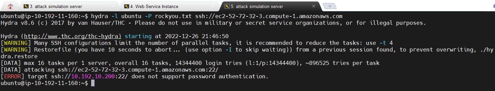
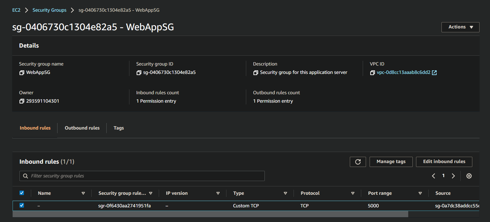
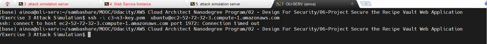
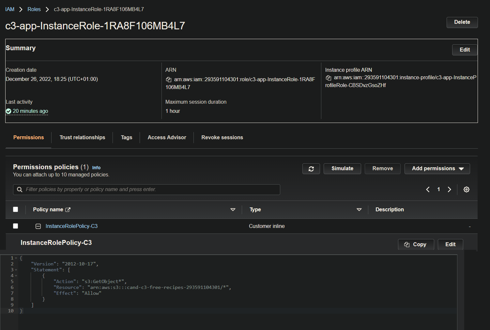
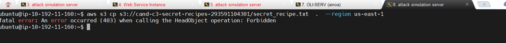
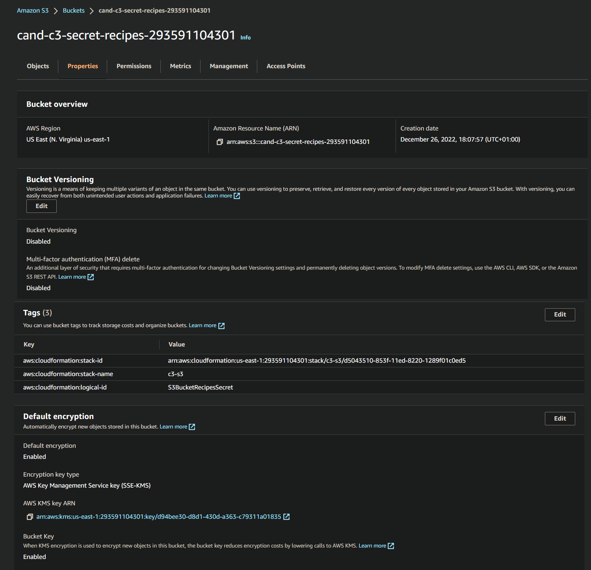
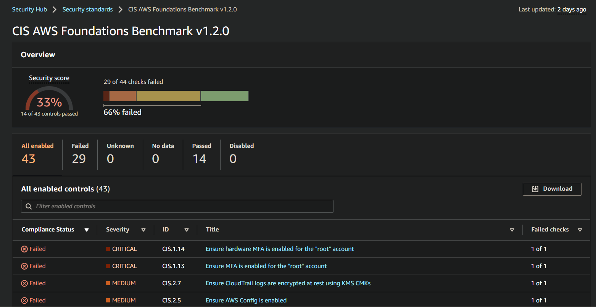

# Exercise 4 - Implement Security Hardening

____

## Task 1 - Remediation plan

As a ``Cloud Architect``, you have been asked to apply security best practices to the environment so that it can withstand attacks and be more secure.

1. Identify 2-3 changes that can be made to our environment to prevent an SSH brute force attack from the internet

2. Neither instance should have had access to the secret recipes bucket; even in the instance that API credentials were compromised how could we have prevented access to sensitive data?

* [E4T1.txt](./E4T1.txt) - Answer to the prompts in Exercise 4, Task 1.

## Task 2 - Hardening

**Remove SSH Vulnerability on the Application Instance**

1. To disable SSH password login on the application server instance.

````bash
# open the file /etc/ssh/sshd_config
sudo vi /etc/ssh/sshd_config

# Find this line:
PasswordAuthentication yes

# change it to:
PasswordAuthentication no

# save and exit

#restart SSH server
sudo service ssh restart
````

2. Test that this made a difference. Run the brute force attack again from Exercise 3, Task 1.

1. Take a screenshot of the terminal window where you ran the attack highlighting the remediation and name it E4T2_sshbruteforce.png.

`**Deliverables**:

* **E4T2_sshbruteforce.png** - Screenshot of terminal window showing the brute force attack and the remediation.


<p style='text-align: center; margin-right: 3em; font-family: Serif;'><b>  Screenshot of terminal window showing the brute force attack and the remediation</b></p>


<figure>
  <b>Fig.1 - 4K Mountains Wallpaper</b></figcaption>
</figure>

**Apply Network Controls to Restrict Application Server Traffic**

1. Update the security group which is assigned to the web application instance. Any method you use to do this is acceptable. The requirement is that we only allow connections to port 5000 from the public subnet where the application load balancer resides.

2. Test that the change worked by attempting to make an SSH connection to the web application instance using its public URL.

3. Submit a screenshot of the security group change and your SSH attempt.

**Deliverables:**

* E4T2_networksg.png - Screenshot of the security group change.


<p style='text-align: center; margin-right: 3em; font-family: Serif;'><b>  Screenshot of the security group change</b></p>

* E4T2_sshattempt.png - Screenshot of your SSH attempt.


<p style='text-align: center; margin-right: 3em; font-family: Serif;'><b>  Screenshot of your SSH attempt</b></p>

**Least Privilege Access to S3**

1. Update the IAM policy for the instance profile role used by the web application instance to only allow read access to the free recipes S3 bucket.

2. Test the change by using the attack instance to attempt to copy the secret recipes.

3. Submit a screenshot of the updated IAM policy and the attempt to copy the files.

**Deliverables**:

* E4T2_s3iampolicy.png - Screenshot of the updated IAM policy.


<p style='text-align: center; margin-right: 3em; font-family: Serif;'><b>  Screenshot of the updated IAM policy</b></p>

* E4T2_s3copy.png - Screenshot of the failed copy attempt.


<p style='text-align: center; margin-right: 3em; font-family: Serif;'><b>  Screenshot of the failed copy attempt</b></p>

**Apply Default Server-side Encryption to the S3 Bucket**

This will cause the S3 service to encrypt any objects that are stored going forward by default. Use the below guide to enable this on both S3 buckets.
Amazon S3 Default Encryption for S3 Buckets

Capture the screenshot of the secret recipes bucket showing that default encryption has been enabled.

**Deliverables**:

* E4T2_s3encryption.png - Screenshot of the S3 bucket policy.


<p style='text-align: center; margin-right: 3em; font-family: Serif;'><b>  Screenshot of the S3 bucket policy</b></p>

## Task 3: Check Monitoring Tools to see if the Changes that were made have Reduced the Number of Findings

1. Go to AWS inspector and run the inspector scan that was run in Exercise

2. After 20-30 mins - check Security Hub to see if the finding count reduced.

3. Check AWS Config rules to see if any of the rules are now in compliance.

4. Submit screenshots of Inspector, Security Hub, and AWS Config titled E4T3_inspector.png, E4T3_securityhub.png, and E4T3_config.png respectively.

**Deliverables**:

* E4T3_securityhub.png - Screenshot of Security Hub after reevaluating the number of findings.


<p style='text-align: center; margin-right: 3em; font-family: Serif;'><b>   Screenshot of Security Hub after reevaluating the number of findings</b></p>

* E4T3_config.png - Screenshot of Config after reevaluating the number of findings.

* E4T3_inspector.png - Screenshot of Inspector after reevaluating the number of findings.

## Task 4: Questions and Analysis

1. What additional architectural change can be made to reduce the internet-facing attack surface of the web application instance.

2. Assuming the IAM permissions for the S3 bucket are still insecure, would creating VPC private endpoints for S3 prevent the unauthorized access to the secrets bucket.

3. Will applying default encryption setting to the s3 buckets encrypt the data that already exists?

4. The changes you made above were done through the console or CLI; describe the outcome if the original cloud formation templates are applied to this environment?

Submit your answers in E4T4.txt.

**Deliverables**:

* E4T4.txt - Answers from prompts in Exercise 4, Task 4.

**Optional Standout Suggestion Task 5 - Additional Hardening**

Make changes to the environment by updating the cloud formation template. You would do this by copying c3-app.yml and c3-s3.yml and putting your new code into c3-app_solution.yml and c3-s3_solution.yml. Brainstorm and list additional hardening suggestions aside from those implemented that would protect the data in this environment. Submit your answers in E4T5.txt.

**Deliverables**:

* Optional ``c3-app_solution.yml`` and ``c3-s3_solution.yml`` - updated cloud formation templates which reflect changes made in E4 tasks related to AWS configuration changes.

* Optional ``E4T5.txt`` - Additional hardening suggestions from Exercise 4, Task 5.
