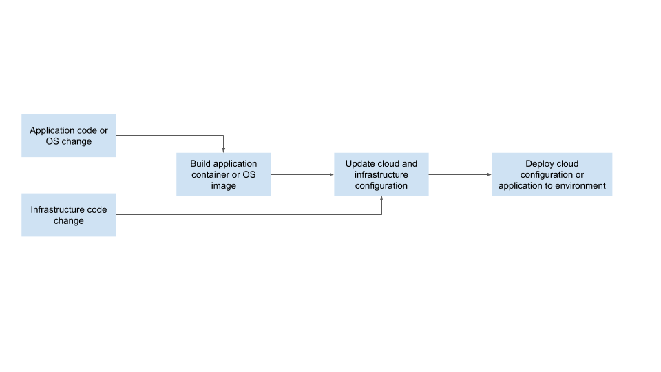
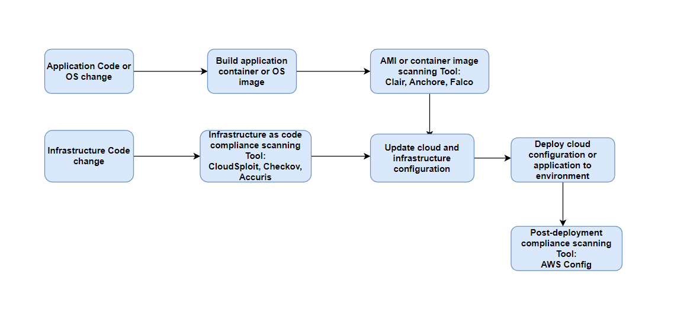

# Exercise 5 - Designing a DevSecOps Pipeline

Take a look at a very common deployment pipeline diagrammed below:

|  |
|:--:|
| <b>DevOps Pipeline</b>|

The high-level steps are as follows:

1. The user makes a change to the application code or OS configuration for a service.

2. Once the change is committed to source, a build is kicked off resulting in an AMI or a container image.

3. The infrastructure as code is updated with the new AMI or container image to use.

4. Changes to cloud configuration or infrastructure as code may have also been committed.

5. A deployment to the environment applies the changes
____

## Task 1 - Design a DevSecOps pipeline

Update the starter ``DevOpsPipeline.ppt`` (or create your own diagram using a different tool) At minimum you will include steps for:

* Infrastructure as code compliance scanning.
* AMI or container image scanning.
* Post-deployment compliance scanning.

**Deliverables:**

* **DevSecOpsPipeline.[ppt or png]** - Your updated pipeline.

|  |
|:--:|
| <b>DevOps Pipeline</b>|

## Task 2 - Tools and Documentation

You will need to determine appropriate tools to incorporate into the pipeline to ensure that security vulnerabilities are found.

1. Identify tools that will allow you to do the following:
   1. a. Scan infrastructure as code templates.

   2. b. Scan AMI’s or containers for OS vulnerabilities.

   3. c. Scan an AWS environment for cloud configuration vulnerabilities.

2. For each tool - identify an example compliance violation or vulnerability that it might expose.

**Deliverables**:

* [E5T2.txt](./E5T2.txt) - Answer from prompts in Exercise 5, Task 2.

**Optional Standout Suggestion Task 3 - Scanning Infrastructure Code**

* Run an infrastructure as code scanning tool on the cloud formation templates provided in the starter.

* Take a screenshot of the tool that has correctly identified bad practices.

* If you had completed the remediations by updating the cloud formation templates, run the scanner and compare outputs showing that insecure configurations were fixed.

**Deliverables**:

* Optional **E5T3.png** - Screenshot of tool that has identified bad practices.

* Optional **E5T3.txt** - Answers from prompts in Exercise 5, Task 3.