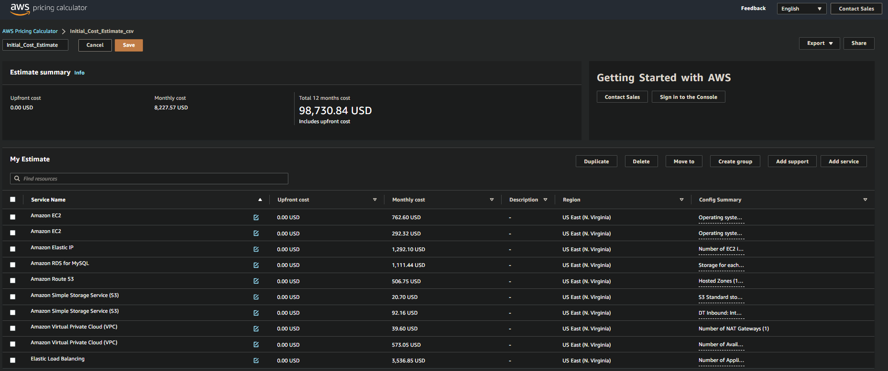
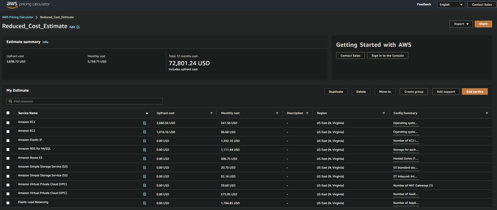

## A.3 Task 2: Calculate Infrastructure Costs

1. Use the [AWS Pricing Calculator](https://calculator.aws/#/) to estimate how much it will cost to run the services in your Part 1 diagram for one month.

* Target a monthly estimate between $8,000-$10,000.
* Be mindful of AWS regions when you are estimating costs.
* Export the estimate as a CSV file named [``Initial_Cost_Estimate.csv``](./doc/Increased_Cost%20Estimate.csv).

 

<b> Initial Cost Estimate </b>

1. Return to the [AWS Pricing Calculator](https://calculator.aws/#/) and reconfigure your estimates for the following scenarios:

* Your budget has been reduced from $8,000-$10,000 to a maximum of $6,500. What services will you modify to meet this new budget? Export the updated costs in a CSV file named [``Reduced_Cost_Estimate.csv``](./doc/Reduced_Cost_Estimate.csv) and write up a brief narrative of the changes you made in the CSV file below the cost estimate.

To be in line with our new budget we will make some adjustments to our configuration:

 

<b> Reduced Cost Estimate </b>

* Your budget has been increased to $20,000. What resources will you add and why?
Think about where to add redundancy and how to improve performance. Re-configure your estimate to a monthly invoice of $18K-20K. Export the updated costs to a CSV file named [``Increased_Cost Estimate.csv``](./doc/Increased_Cost%20Estimate.csv) and write up a brief narrative of the changes you made in the CSV file below the cost estimate.

 

<b> Increased Cost Estimate </b>
