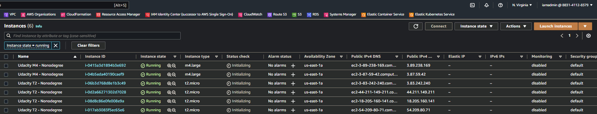
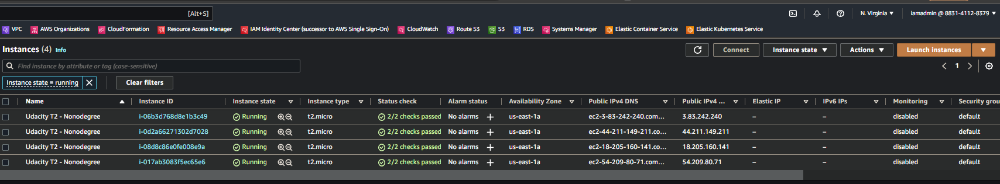
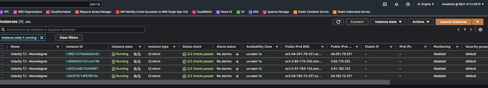
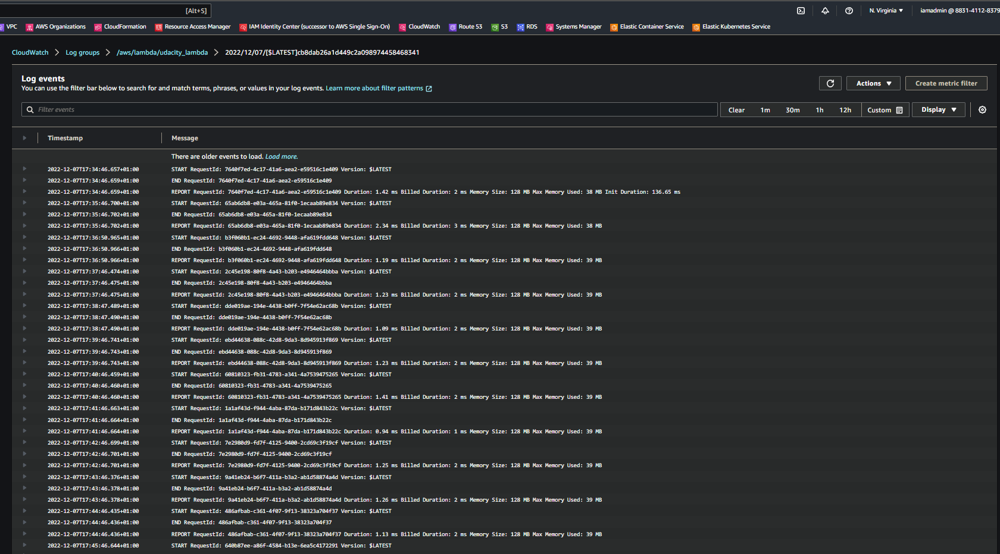

## Task 5: Use Terraform to Provision AWS Infrastructure
### A.6.1 Part 1

1. Download the **starter code**.

2. In the ``main.tf`` file write the code to provision

* AWS as the cloud provider
* Use an existing VPC ID
* Use an existing public subnet
* 4 AWS t2.micro EC2 instances named Udacity T2
* 2 m4.large EC2 instances named Udacity M4

3. Run Terraform.

4. Take a screenshot of the 6 EC2 instances in the AWS console. Save it as ``Terraform_1_1.png`` or ``Terraform_1_1.jpg`` .

 

<b> Instances Build With Terraform </b>

5. Use Terraform to delete the 2 m4.large instances.

6. Take an updated screenshot of the AWS console showing only the 4 t2.micro instances and save it as ``Terraform_1_2.png`` or ``Terraform_1_2.jpg``

 

<b> 4 t2.micro Instances Build With Terraform </b>

## A.6.2 Part 2

1. In the Exercise_2 folder, write the code to deploy an AWS Lambda Function using Terraform. Your code should include:

* A lambda.py file
* A main.tf file
* An outputs.tf file
* A variables.tf file

2. Take a screenshot of the EC2 instances page and save it as ``Terraform_2_1.png`` or ``Terraform_2_1.jpg``.

 

<b> EC2 instances page </b>

3. Take a screenshot of the VPC page and save it as ``Terraform_2_2.png`` or ``Terraform_2_2.jpg``.

 

<b> VPC page </b>

4. Take a screenshot of the CloudWatch log entry for the lambda function execution and save it as ``Terraform_2_3.png`` or ``Terraform_2_3.jpg``.

 

<b> Screenshot of CloudWatch Logs </b>

