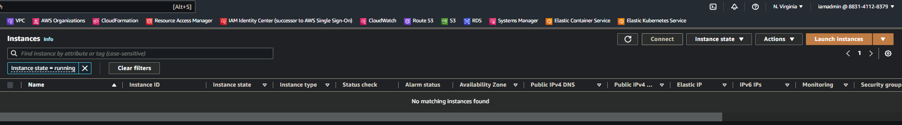

## Task 6: Destroy the Infrastructure using Terraform and prepare for submission

1. Destroy all running provisioned infrastructure using Terraform so as not to incur unwanted charges.

2. Take a screenshot of the EC2 instances page and label it ``Terraform_destroyed.png`` or ``Terraform_destroyed.jpg`` .

 

<b> Secondary VPC subnet in North California </b>

1. Upload Terraform files, screenshots, schematics and CSV files to your GitHub repo
Before submitting your project, please check to confirm that you have completed all of the requirements in the **Project Rubric**.
